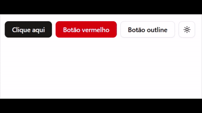

This is a [Next.js](https://nextjs.org) project bootstrapped with [`create-next-app`](https://github.com/vercel/next.js/tree/canary/packages/create-next-app).

## Getting Started

First, run the development server:

```bash
npm run dev
# or
yarn dev
# or
pnpm dev
# or
bun dev
```

Open [http://localhost:3000](http://localhost:3000) with your browser to see the result.

You can start editing the page by modifying `app/page.js`. The page auto-updates as you edit the file.

This project uses [`next/font`](https://nextjs.org/docs/app/building-your-application/optimizing/fonts) to automatically optimize and load [Geist](https://vercel.com/font), a new font family for Vercel.

## Learn More

To learn more about Next.js, take a look at the following resources:

- [Next.js Documentation](https://nextjs.org/docs) - learn about Next.js features and API.
- [Learn Next.js](https://nextjs.org/learn) - an interactive Next.js tutorial.

You can check out [the Next.js GitHub repository](https://github.com/vercel/next.js) - your feedback and contributions are welcome!

## Deploy on Vercel

The easiest way to deploy your Next.js app is to use the [Vercel Platform](https://vercel.com/new?utm_medium=default-template&filter=next.js&utm_source=create-next-app&utm_campaign=create-next-app-readme) from the creators of Next.js.

Check out our [Next.js deployment documentation](https://nextjs.org/docs/app/building-your-application/deploying) for more details.


## Bytes 4 Future

### O que é este repo?

Este é um repo template, nele estemos instalados alguns recuros incriveis que poderão ultilizar na tua aplicação.

Neste documento vamos seguir o fluxo de instalação dos pacotes `passo a passo` baseando-se nos commits deste projeto. Portanto, sempre que veres a indicação de um commit podes abrir o link e aceder o github daquela ação para veres quais arquivos foram alterados, desta forma percebendo as mudanças.

### O que foi instalado?

#### NextJS
No primeiro Commit [`59addda`](https://github.com/ledevmacedo/nextjs-js-template/commit/59addda40e532c57d8a3521d64ad9a3576995656) instalamos a base do projeto com:

- **Next.js (JavaScript)**: framework React com roteamento, Server Components e otimizações.
- **TailwindCSS**: utilitários de CSS para estilização rápida e consistente.
- **Biome**: linter e formatador para manter o código padronizado.
- **Turbopack**: dev server mais rápido para um feedback ágil durante o desenvolvimento.

Essa etapa apenas prepara o ambiente com as ferramentas essenciais para começar a construir a aplicação.

#### ShadcnUI

Aqui as coisas começam a ficar interessantes! 😁🎨

##### O que é o ShadcnUI?
É um conjunto de componentes acessíveis e personalizáveis, baseados em **TailwindCSS** e **Radix UI**. Ele utiliza **CVA (Class Variance Authority)** para facilitar a criação de variantes de estilo (por exemplo, `variant="outline"`, `size="sm"`). A ideia é montar uma biblioteca local de componentes através de "copy & paste", mantendo controle total do código.

Por que usar?
- **Produtividade**: componentes prontos para casos comuns (botões, diálogos, inputs, etc.).
- **Consistência**: variações de estilo centralizadas via CVA.
- **Acessibilidade**: Radix UI cuida de comportamentos e padrões de acessibilidade.

Exemplo rápido com o nosso `Button` em `src/components/ui/button.jsx`:

```jsx
import { Button } from "@/components/ui/button";

export default function Exemplo() {
  return (
    <div className="flex gap-2">
      <Button>Primário</Button>
      <Button variant="outline">Outline</Button>
      <Button variant="destructive" size="sm">Apagar</Button>
    </div>
  );
}
```

Com isso, você cria interfaces ricas rapidamente, focando apenas nas variações de tema e na composição de componentes — sem precisar reimplementar cada peça do zero.

#### Next-Themes

Commit:  [`e1cf22b`](https://github.com/ledevmacedo/nextjs-js-template/commit/e1cf22bc7c52faafb0e2a64e7ad434fb19b2f85a)

O `next-themes` gerencia temas (light/dark/system) no Next.js de forma simples e acessível. Integra muito bem com os componentes do ShadcnUI.

Observação importante: no site do ShadcnUI, muitos exemplos estão em TSX. Aqui o projeto é em JavaScript, então converti esses trechos para JSX. Se você seguir o guia em TS e algo não funcionar no seu projeto JS, esse pode ser o motivo 😬.

Passo a passo da configuração:
1. Instalação do pacote:
   
   ```bash
   npm i next-themes
   ```

2. Criação da pasta de providers:
   - Pasta: `src/providers`

3. Criação do `theme-provider.jsx` (envolve a árvore com o `ThemeProvider` do `next-themes`):

   ```jsx
   "use client";
   import * as React from "react";
   import { ThemeProvider as NextThemesProvider } from "next-themes";

   export function ThemeProvider({ children, ...props }) {
     return <NextThemesProvider {...props}>{children}</NextThemesProvider>;
   }
   ```

4. Criação do `providers.jsx` para centralizar os providers do app (e facilitar adicionar novos futuramente):

   ```jsx
   "use client";
   import { ThemeProvider } from "@/providers/theme-provider";

   export function Providers({ children }) {
     return (
       <ThemeProvider attribute="class" defaultTheme="system" enableSystem>
         {children}
       </ThemeProvider>
     );
   }
   ```

5. Uso no `layout.jsx`: encapsular o `children` com `Providers`:

   ```jsx
   import { Providers } from "@/providers/providers";

   export default function RootLayout({ children }) {
     return (
       <html lang="pt">
         <body>
           <Providers>{children}</Providers>
         </body>
       </html>
     );
   }
   ```

Teste realizado:
1. Instalei o componente `mode-toggle.jsx` do ShadcnUI e importei na página inicial para validar a troca de tema.

